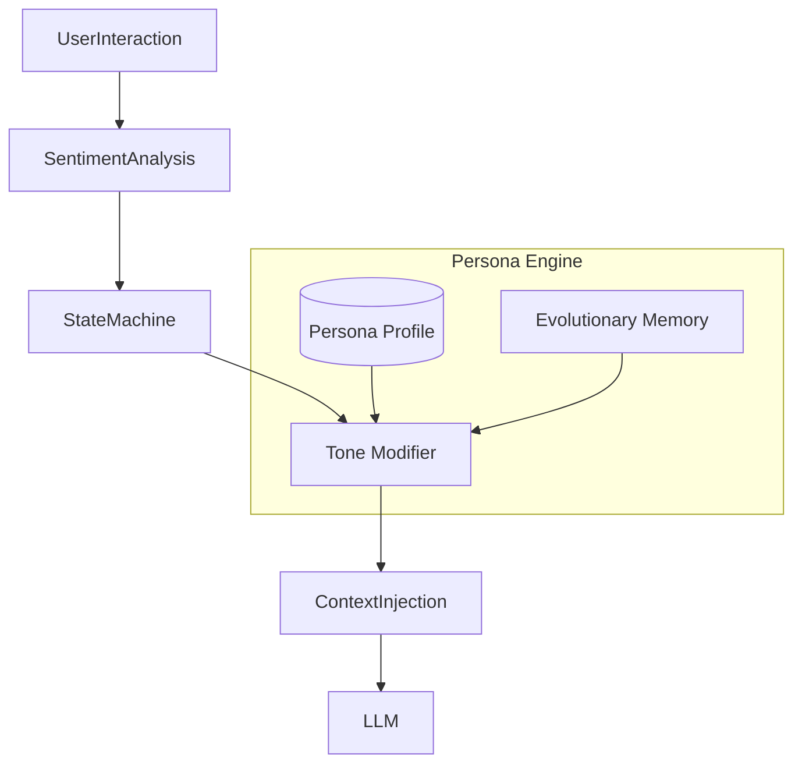

# Adaptive Persona Engine (APE) - Technical Specification

> [!NOTE]
> **Optional Plugin**: This module enables dynamic personality management. It is designed for applications requiring high emotional intelligence and user personalization.

## 🎯 Goal

The **Adaptive Persona Engine (APE)** gives the AI a consistent, evolving "identity." It moves beyond static system prompts by creating a stateful persona that:

1. **Maintains Continuity**: Remembers tone and interaction style across sessions.
2. **Adapts**: Subtlely shifts tone based on user sentiment (e.g., becoming more empathetic if the user is frustrated).
3. **Evolves**: Grows its knowledge base of user preferences and communication style over time.

## 🏗️ Architecture

APE functions as a **State Management System** for the AI's personality. It injects dynamic persona instructions into the context window based on the current interaction state.



## 🧩 Internal Modules

### 1. Persona Profile Manager

- **Function**: Stores the immutable core traits of the AI (e.g., Name: "Cortex", Role: "Senior Architect", Core Values: "Precision, Safety").
- **Storage**: JSON configuration or database record.

### 2. Tone & Style Analyzer

- **Function**: Analyzes user input for sentiment (Angry, Confused, Happy) and complexity.
- **Mechanism**: Uses NLU (Natural Language Understanding) to classify the "mood" of the conversation.

### 3. Adaptive Mirroring Engine

- **Function**: Adjusts the AI's response style to match or complement the user.
  - *User is technical* -> AI becomes more concise and technical.
  - *User is a beginner* -> AI becomes more explanatory and encouraging.

### 4. Evolutionary Memory

- **Function**: Records successful interaction patterns. If the user praises a specific explanation style, APE remembers to use it again.

## 🔌 API Interfaces

### `initializePersona`

Loads a persona profile into the active session.

```typescript
interface PersonaConfig {
  id: string;
  name: string;
  baseTone: 'professional' | 'friendly' | 'academic';
  traits: string[];
}

const agentPersona = ape.initializePersona({
  id: 'senior-dev-01',
  name: 'Cortex',
  baseTone: 'professional',
  traits: ['concise', 'opinionated', 'security-first']
});
```

### `adaptContext`

Middleware that modifies the system prompt before sending to the LLM.

```typescript
interface InteractionContext {
  userMessage: string;
  history: Message[];
}

// Returns the injected system instructions
const personaPrompt = await ape.adaptContext(currentInteraction);
// Output: "You are Cortex. The user appears frustrated. meaningful explanation is required. Adopt a calm, supportive tone."
```

## 🚀 Development Phases

1. **Phase 1 (Static)**: Implement JSON-based profiles and basic prompt injection.
2. **Phase 2 (Reactive)**: Add sentiment analysis to adjust tone in real-time.
3. **Phase 3 (Long-term)**: Implement vector-based memory to recall user preferences across sessions.
