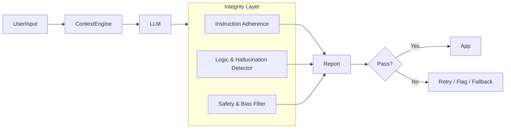

# Prompt Integrity & Verification Layer (PIVL) - Technical Specification

> [!NOTE]
> **Optional Plugin**: This module is an extension of the AI Core architecture. Its usage is recommended for high-stakes applications requiring strict output validation.

## 🎯 Goal

The **Prompt Integrity & Verification Layer (PIVL)** serves as the "Conscience" of the AI system. Its primary mission is to audit the AI pipeline in real-time to ensure:

1. **Adherence**: The model followed all strict instructions in the prompt.
2. **Accuracy**: The output is logically consistent and factually plausible (within defined bounds).
3. **Safety**: The response is free from hallucinations, bias, and harmful content.

## 🏗️ Architecture

PIVL operates as a **post-processing middleware** that sits between the LLM connector and the final application response. It functions as an adversarial auditor—assuming the LLM might be wrong until proven right.



## 🧩 Internal Modules

### 1. Instruction Adherence Module

- **Function**: Parses the system prompt constraints (e.g., "Answer in JSON only", "Do not mention competitor X") and verifies the output against them.
- **Mechanism**: Uses regex patterns for structural checks and a lightweight "Verifier Model" (e.g., a smaller, specialized LLM) for semantic checks.

### 2. Hallucination & Logic Detector

- **Function**: Identifies logical fallacies, contradictions, or ungrounded claims.
- **Mechanism**:
  - **Self-Consistency**: Asks the model to verify its own answer.
  - **Citation Checking**: If RAG is used, ensures cited sources actually contain the referenced information.

### 3. Safety & Bias Filter

- **Function**: Scans for PII (Personally Identifiable Information), toxic language, or biased assumptions.
- **Mechanism**: Heuristic filters + Embedding similarity checks against a "Bad Concepts" database.

## 🔌 API Interfaces

### `verifyResponse`

Main entry point for the verification process.

```typescript
interface VerificationRequest {
  prompt: string;
  response: string;
  constraints: string[]; // List of specific rules to check
  config: {
    strictMode: boolean;
    retryOnFail: boolean;
  };
}

interface VerificationResult {
  isValid: boolean;
  score: number; // 0.0 to 1.0
  issues: string[];
  correctedResponse?: string;
}

// Example Usage
const report = await pivl.verifyResponse({
  prompt: userPrompt,
  response: llmOutput,
  constraints: ["Must be JSON", "No external links"],
  config: { strictMode: true, retryOnFail: false }
});

if (!report.isValid) {
  console.warn("Integrity check failed:", report.issues);
}
```

### `generateAuditReport`

Produces a detailed log for compliance and debugging.

```typescript
function generateAuditReport(sessionId: string): AuditLog;
```

## 🚀 Development Phases

1. **Phase 1 (Core)**: Implement Regex-based structural checks and basic PII filtering.
2. **Phase 2 (Semantic)**: Integrate a lightweight Verifier LLM for instruction adherence.
3. **Phase 3 (Fact-Checking)**: Connect to RAG sources for citation verification.
